# Data Lovers

**Proceso de diseño**

**1** El proceso de diseño del producto comenzó con una investigación, la cual incluye una encuesta sobre Pokémon.

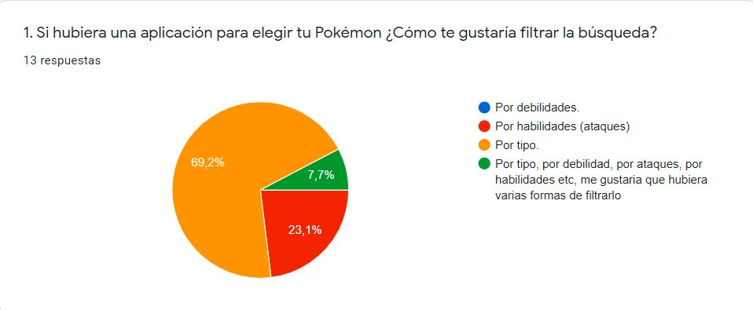
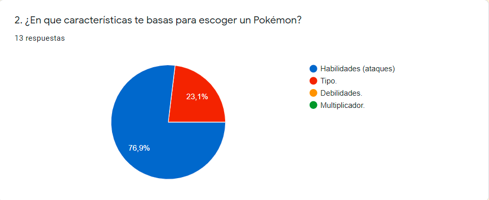
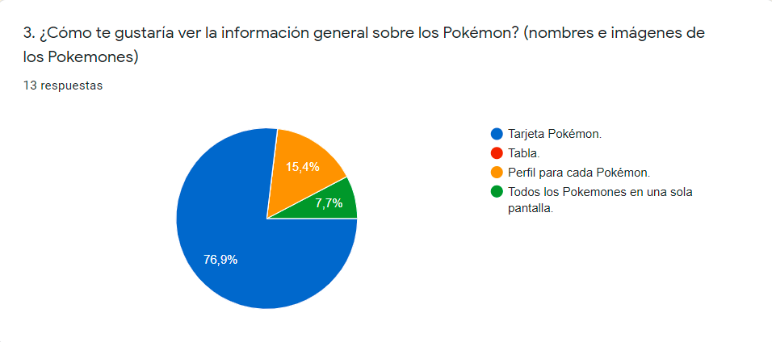
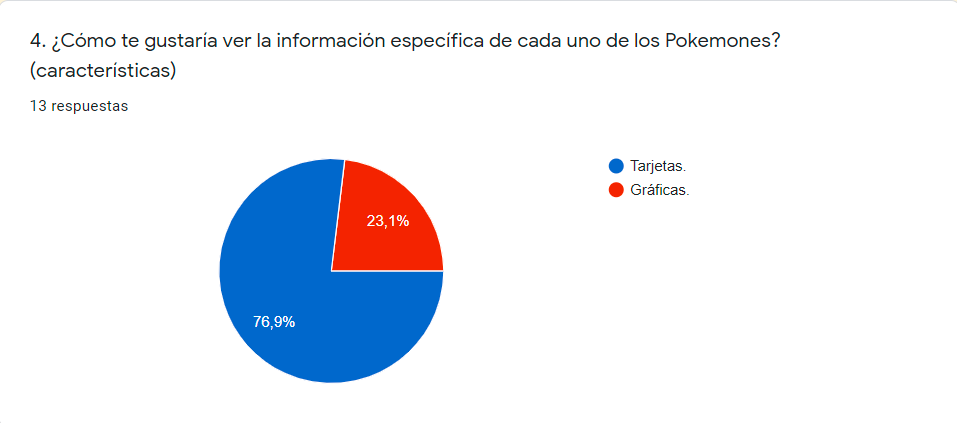
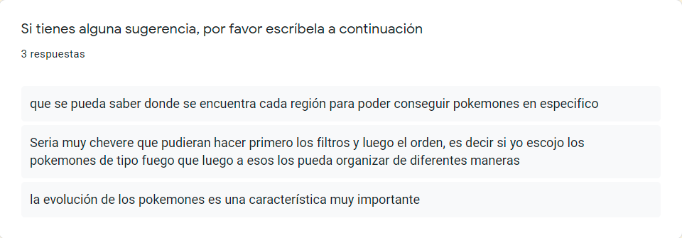

**2** Luego se le dió respuesta a las siguientes preguntas: 

* ¿Quiénes son los principales usuarios de producto?
  En primer lugar los usuarios de Pokémon Go, y en segundo lugar todo aquel que desee obtener información sobre Pokémon en general.
* ¿Cuáles son los objetivos de estos usuarios en relación con el producto?
  Conocer información específica sobre los Pokemons de las regiones de Kanto y Johto; información que debe estar organizada de manera clara y concisa; y como valor agregado sea de fácil lectura. 
* ¿Cuáles son los datos más relevantes que quieren ver en la interfaz y por qué?
  Según los usuarios, se les hace más cómodo filtrar por tipo, pues esta característica la tienen singularmente presente gracias a que con solo saber el tipo hacen un estimado de sus fortalezas y debilidades. También se les hace relevante a la hora de escoger un Pokémon, observar los ataques, para saber que facilidad tienen de ganar. 
* ¿Cuándo utilizan o utilizarían el producto?
  Lo utilizarían cuando necesiten conocer algún tipo de información sobre los Pokemons.
* ¿Como crees que el producto resuelve el problema (o problemas) que tiene tu usuario?
  - Tienen una página que les permite interactuar a través de filtrados y organización del contenido, según sus necesidades de búsqueda.
  - La página les ofrece información clave a la hora de elegir un Pokémon, estando esta organizada de forma clara y concisa.
  - Se tiene contenido gráfico, haciendo que el usuario tenga un reconocimiento visual rápido de cada uno de los Pokemons.
* Definición del producto:
  El producto le entrega al usuario información útil y precisa sobre los Pokemons de las regiones de Kanto y Johto, haciendo que estos se asesoren de manera clara, rápida y sencilla a la hora de elegir un Pokémon; y además les permite interactuar haciendo más amigable su búsqueda.
* Toda tu investigación previa debe tener como resultado todas las Historias
  de Usuario de tu proyecto.

**3** En base a la encuesta y las preguntas se hicierón las siguientes Historias de Usuario:

**Historia de Usuario 1:**
Yo como visitante.
Quiero ver la información general organizada tipo tarjeta.
Para tener una visualización más rápida de los Pokémons.

**Criterios de aceptación:**

* El usuario puede visualizar los Pokémon de manera individual (tarjeta).  

* Cada Pokémon lleva su foto, debajo su nombre y su número, y más inferiormente el tipo al que pertenece.

* El tipo lleva un color representativo.

* Los Pokemons están organizados en 2 filas y 3 columnas.

* Los Pokemons están organizados en orden numérico de menor a mayor.

* Debe ser responsive para desktop, tablet y mobile.

**Definición de terminado:**

* El código cumple con la guía de estilos acordada. 

* El código tiene, y pasa, los tests necesarios.

* El código está en el repositorio, más específicamente en la rama master.

* El proyecto está desplegado en gitHub Pages.

* Se ha hecho pair-programming mínimo una hora al día.

* Se ha hecho code-review en el equipo. 

* La historia implementada ha sido testeada con, al menos 3 usuarios y se han incorporado las mejoras que se identificaron en este testeo de usabilidad.

**Historia de Usuario 2:**
Yo como visitante.
Quiero filtrar la información principalmente por tipo, y luego por región, por debilidad y resistencia y además, poder ordenar el contenido según mi preferencia.
Para reducir la cantidad de información y así poder elegir el Pokémon de mi agrado de manera más fácil y rápida.

**Criterios de aceptación:**

* El usuario tendrá a su disposición todo el tiempo, las funciones de filtrado y organización, en la parte superior de la página. 

* El usuario visualizará el resultado de cada filtro, depurando la información hasta que la página lo lleve a los posibles Pokémons de su agrado.

* El usuario podrá manipular la barra del lado derecho para subir y bajar en la página, pudiendo así ver todos los Pokemons del filtrado.

* Los Pokemons están organizados en filas y columnas según el filtrado (cantidad).

**Definición de terminado:**

* El código cumple con las funcionalidades y estilos acordados. 

* El código tiene, y pasa, los tests necesarios.

* El código está en el repositorio, más específicamente en la rama master.

* El proyecto está desplegado en gitHub Pages.

* Se ha hecho pair-programming mínimo una hora al día.

* Se ha hecho code-review en el equipo. 

* La historia implementada ha sido testeada con, al menos 3 usuarios y se han incorporado las mejoras que se identificaron en este testeo de usabilidad.

**Historia de Usuario 3:**
Yo como visitante. 
Quiero ver la información específica (características) organizada tipo tarjeta.
Para tener mayor facilidad de lectura sobre las características claves de cada Pokémon.

**Criterios de aceptación:**

* El usuario puede acceder a través de un clic a las características del Pokémon desde su tarjeta individual. 

* El usuario podrá visualizar en una sola tarjeta las características, divididas según el tipo de información. 

* Habrán cuatro botones seleccionables por tarjeta, el primero de ellos tendrá la descripción del Pokémon, el tipo, rareza, generación  y las características físicas (peso ,altura) del mismo; el segundo contendrá las estadísticas relacionadas con ataque base, defensa base, resistencia base, máximo de puntos en combate y máx.-hp; el tercero contendrá las evoluciones del Pokémon y la información del huevo; y el cuarto contendrá los ataques especiales y movimientos rápidos.

**Definición de terminado:**

*  El código cumple con las funcionalidades y estilos acordados. 

* El código tiene, y pasa, los tests necesarios.

* El código está en el repositorio, más específicamente en la rama master.

* El proyecto está desplegado en gitHub Pages.

* Se ha hecho pair-programming mínimo una hora al día.

* Se ha hecho code-review en el equipo. 

* La historia implementada ha sido testeada con, al menos 3 usuarios y se han incorporado las mejoras que se identificaron en este testeo de usabilidad.

**4** Habiendo tenido en cuenta la anterior investigación, se procedió con los prototipos de baja fidelidad (lápiz y papel).

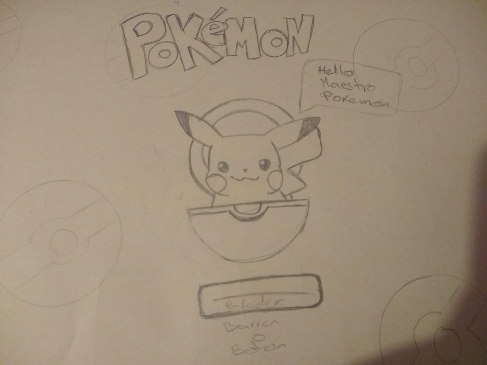

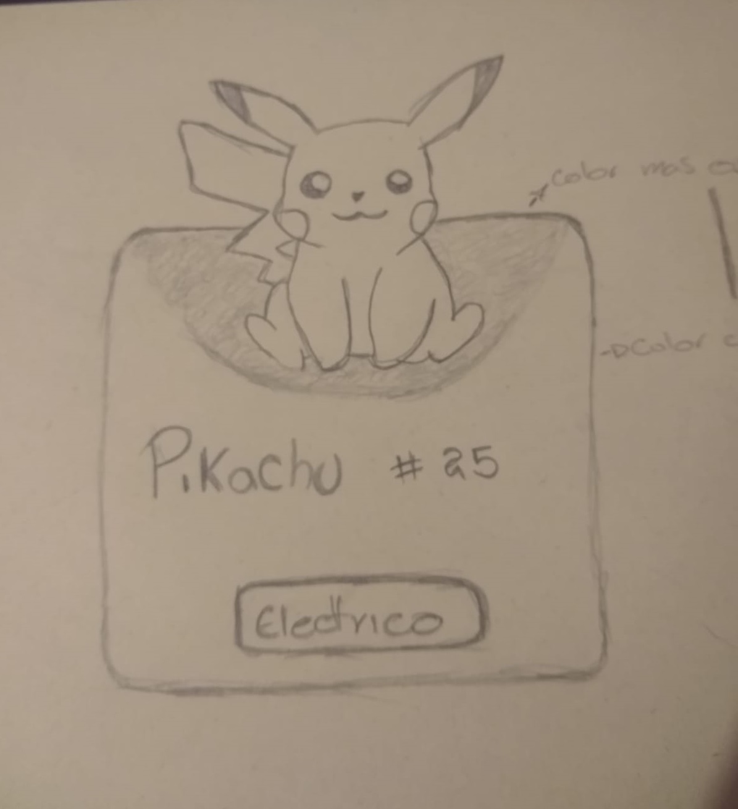
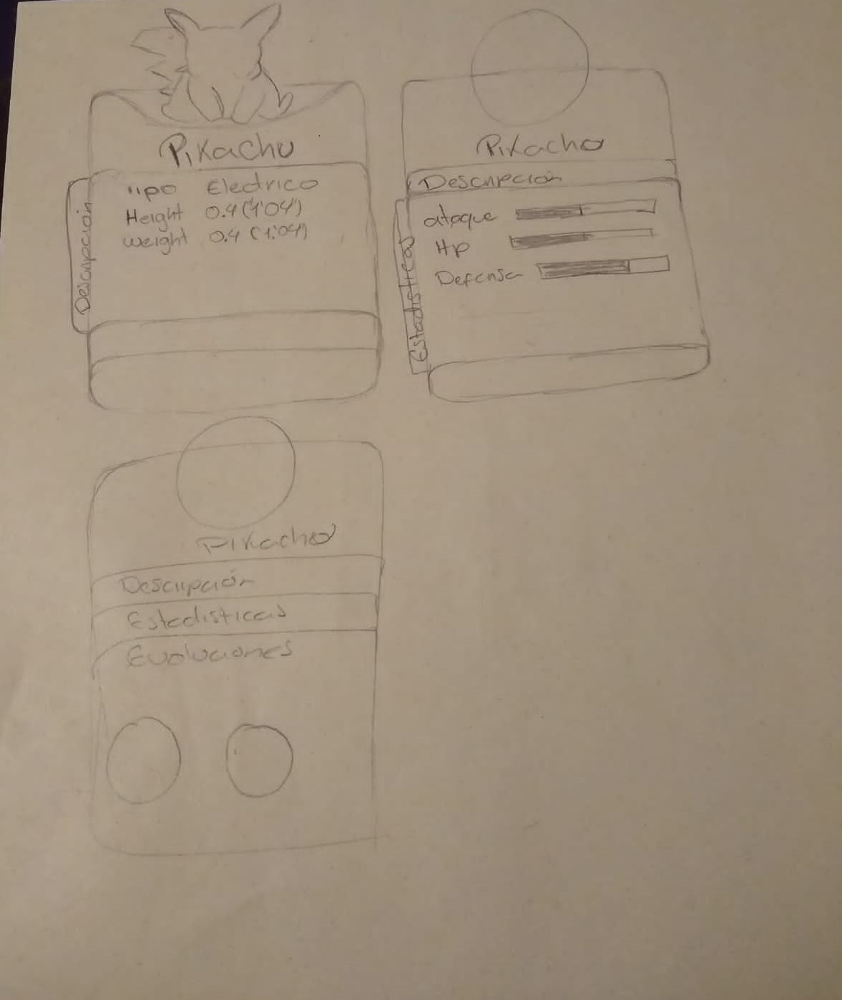

Listado de problemas que se detectarón a través de tests de usabilidad  y cómo se mejoró en propuesta final:
* Se les mostrarón tres clases de prototipos (página de bienvenida) a los diferentes usuarios, de los cuales el 100% escogierón el Pikachu_3 (Pikachu volteado, dando la espalda).
* Los usuarios testeados afirmaron que efectivamente, les parece más cómodo tener varios filtros en la página, pues se les sintetiza más el proceso a la hora de buscar la información. Además aconsejarón que los desplegables de filtrado, el botón buscar y el ordenar por, permanezcan constantes durante toda la búsqueda; así que estos se pusierón en todos los deseños. 
* Se nos persuadió sobre darle más importancia a la jerarquía de terminos correspondientes a la página de aparición de los principales Pokemons (jerarquí dentro de las tarjetas); por lo que se le dió mayor tamaño al nombre, luego al número y por último al tipo.  
* Al enseñarles a los usuarios testeados dos tipos de diseños para la información específica, estos afirmaron les parecio más práctico el que desglosa el contenido (características) por botones que el que lo hace de manera desplegable; por lo que se dejó el diseño elegido. 

**5** Se hizo la iteración de los prototipos de baja fidelidad, se incluyerón las mejoras y se llego a un prototipo final de baja fidelidad.

**6** Consiguiente a esto se diseñó el prototipo de alta fidelidad (Figma).

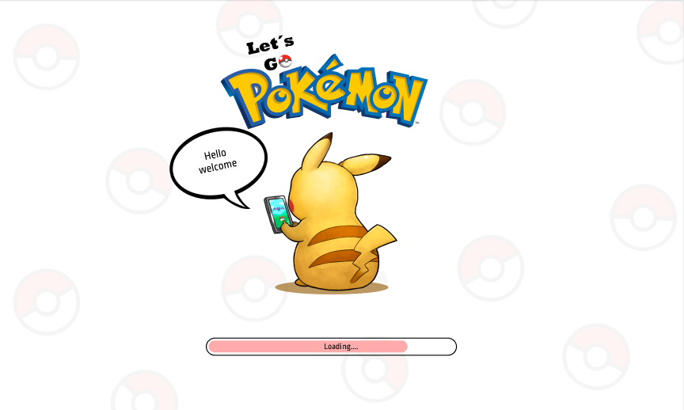
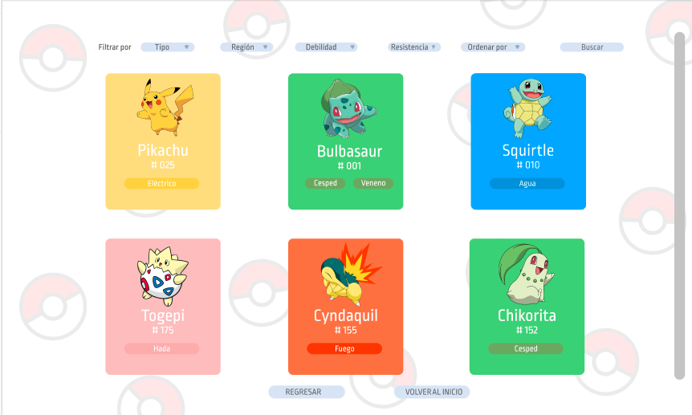
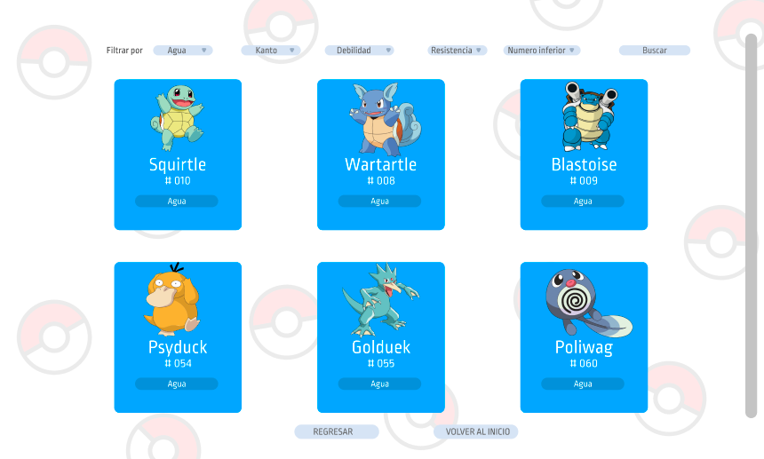
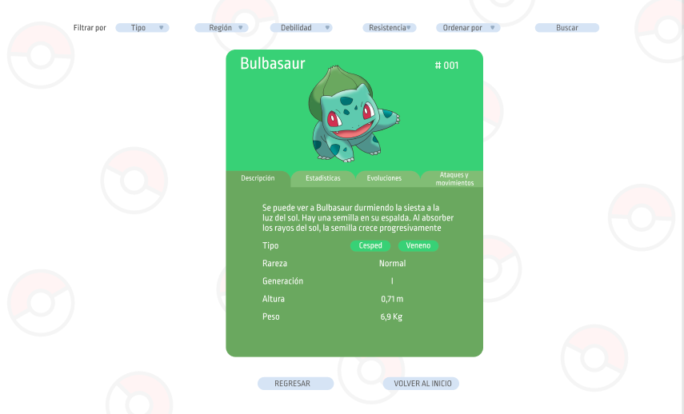

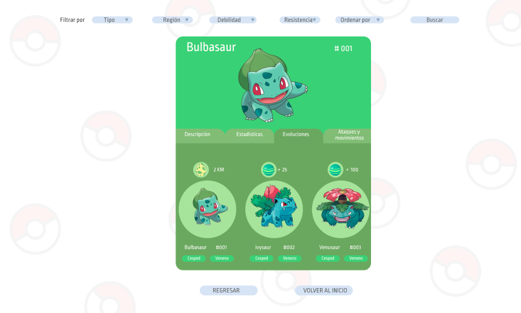

**Link a Figma:**
